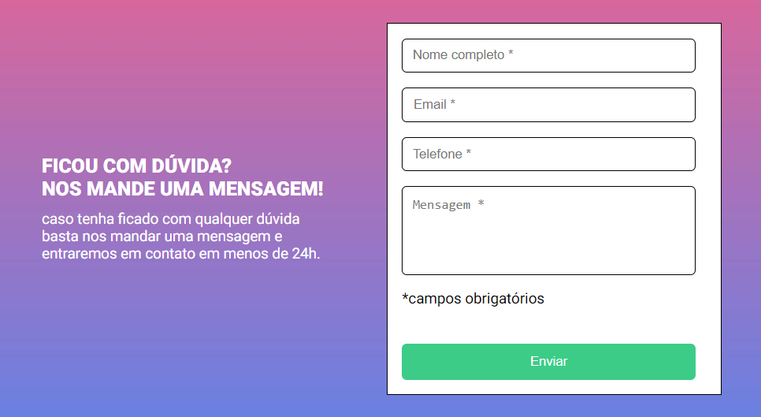
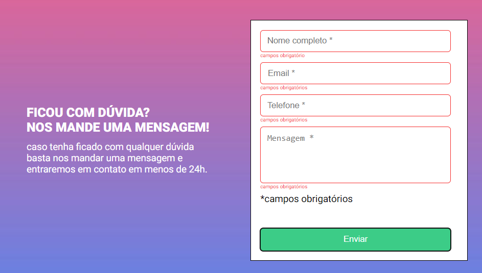

<h1 align="center">Formulário com Validação</h1>

<h4 align="center">🚀 Concluido 🚀</h4>

Tabela de conteúdos
=================

   * Sobre o projeto
   * Tecnologias
   * Layout

## Sobre o Projeto

Bem seguindo os módulos do curso DevQuest Full-Stack, agora no módulo Javascript intermediário, o projeto consiste basicamente na criação de um formulário de contato com validação de campos obrigatórios. Ou seja como os campos são obrigatórios, se caso algum campo não estiver preenchido, a borda do input deve ficar vermelha e uma mensagem de "campo obrigatório" deve aparecer embaixo do campo que não foi preenchido, assim como a borda
do input deve ficar verde e não haverá a mensagem de "campo obrigatório", já que o campo foi preenchido. O formulário também foi desenvolvido para se adaptar a diferentes tamanhos de tela, para uma melhor experiência do usuário .

---

## 🛠 Tecnologias utilizadas

- HTML
- CSS
- Javascript

## 🎨 Layout

### Web 💻:
 
 

formulário inicial:

 
 

formulário com erro:

 
 

formulário completo:

 

formulário na prática:

### Mobile 📱:

